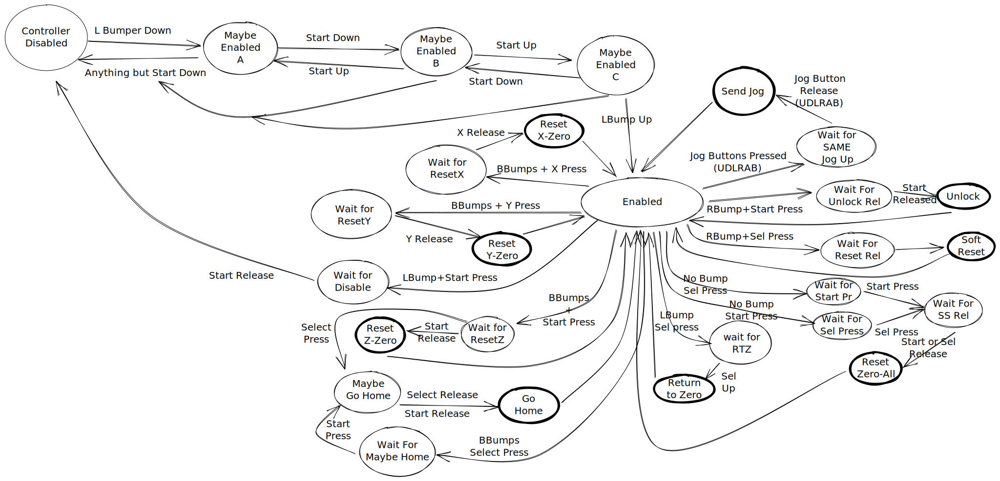

# snes-jog

Code and Instructions for using a SNES Classic gamepad as a CNC Jog Controller
with fabulously free & useful
[Universal GCode Sender](http://winder.github.io/ugs_website/). I learned
everything in the code from trial & error, plus reading through
[this file](https://github.com/mistydemeo/super_nes_classic_edition_oss/blob/master/clvcon-km-6fd0ec177b321206da5bc1b288fd6d7fdf5df7ae/clvcon-km-6fd0ec177b321206da5bc1b288fd6d7fdf5df7ae/clvcon.c).
Good luck! Feel free to open issues. I'm posting this to github before I've
tested it with my CNC, so who knows if it works yet (It looks like it sends the
keystrokes I want)

# Incomplete instructions

# How to make a Jog Controller for use with UGS from an SNES classic controller

The SNES Classic controller is a simple I2C peripheral. For folks who don't know
what that is, just trust that this makes it _super_ easy to talk to.

## Requirements

- Hardware

  - SNES Classic Mini controller (Wired)
    [Amazon link for the controller](https://www.amazon.com/Mario-Retro-SNES-MINI-Controller-Compatible/dp/B0779DS931/ref=sr_1_54_sspa?dchild=1&keywords=SNES&qid=1631203806&s=videogames&sr=1-54-spons&psc=1&spLa=ZW5jcnlwdGVkUXVhbGlmaWVyPUExN1ZZMDk0UjdEVEc4JmVuY3J5cHRlZElkPUEzU0pFS1VYOVBXMkxBJmVuY3J5cHRlZEFkSWQ9QTA2MTE1NzYxNTBXNTRDMERJQ1lTJndpZGdldE5hbWU9c3BfbXRmJmFjdGlvbj1jbGlja1JlZGlyZWN0JmRvTm90TG9nQ2xpY2s9dHJ1ZQ==),
    [Amazon link for the whole package](https://www.amazon.com/Console-Classic-Built-Controllers-Birthday/dp/B08V4RJQPF/ref=sr_1_2_sspa?dchild=1&keywords=SNES+classic&qid=1631204003&s=videogames&sr=1-2-spons&psc=1&spLa=ZW5jcnlwdGVkUXVhbGlmaWVyPUEzSUZEMTBaTDBSUFBOJmVuY3J5cHRlZElkPUEwMTczMzg0MllGV1hEMDNGR0Y5TSZlbmNyeXB0ZWRBZElkPUEwMjYwMDk0MjNWWUc2N0ZWOFFENSZ3aWRnZXROYW1lPXNwX2F0ZiZhY3Rpb249Y2xpY2tSZWRpcmVjdCZkb05vdExvZ0NsaWNrPXRydWU=)
  - An Arduino-compatible device that supports both USB keyboard protocol & I2C.
    Some possibilities:

    - Keebio USB Elite-C ($20) **Fully tested and working with my CNC**
    - Teensy LC/3/4 ($10-$20) **Software Tested**
    - SparkFun Pro Micro ($20)
    - SEEED's XIAO devices looks like the smallest & cheapest ($6!) doodad that
      fits the bill
    - Adafruit nRF52840 devices ($15-$30)
    - Arduino Nano? (??)
      - (A _lot_ of devices fall under this guise. I have a variety of these
        laying around.)
    - TODO: Make links to those things?

  - Optional:
    - A Nintendo Controller female adapter plug (TODO: Link?)
      - I didn't bother with my initial build
      - This would enable you to NOT cut the wires for the controller, making
        the end result a bit 'cleaner'

- Software

  - Arduino Studio (available for Mac, PC, and Linux: I've used all 3
    successfully)
  - Depending on the device, you make need separate 'flashing' software.
    - Getting Arduino Studio and firmware flashing up & going is beyond the
      scope of these instructions
    - TODO: Link to directions for all. I've got multiple of each...

- Tools

  - Soldering Iron & Solder
  - Without the adapter, wire cutters
  - Optional
    - Hot glue gun & hot glue

- Skills

  - Soldering
  - Wire stripping
  - Ability to edit UGS key-mappings
  - Digging around on your Arduino-compatible device's pinout diagram to figure
    out which pins are: Power, Ground, SCL, and SDA.
  - Installing Arduino "stuff"
  - Using Arduino to build & flash your device
  - TODO: I could host builds for various devices, to eliminate most of the
    Arduino requirements

- Unnecessary skills
  - Programming: I've taken care of that part for you!

## Steps

### Without the Nintendo Controller Adapter plug

If you didn't get a Nintendo Controller adapter plug, you'll need to cut the
plug off of your SNES Classic controller & strip the 4 wires so you can solder
them to your controller. The 4 wires in my controller are Red, White, Yellow,
and Green.

Identify which pins on your Arduino-ish device are

- Power
  - Often referred to as "VCC" in pinout diagrams. Some devices have 3V and 5V
    power available. Both seem to work with the SNES I have: Your Mileage May
    Vary)
- Ground
  - Typically "GND". Frequently there are multiple of them available.
- SCL
  - This is the I2C bus' "Clock" pin. It's probably labeled exactly SCL. It
    might also be labeled SCL0 or I2C_SCL or something.
- SDA
  - This is the I2C bus' "Data" pin. If your device has multiple I2C buses
    available, make sure you're using the same as the SCL pin (SCL0, then SDA0:
    If you're using SCL1, you probably need to make minor edits to the code and
    make sure you're using SDA1)

Once you've identified which pins are which, solder the wires from your SNES
controller to the Arduino-ish device like this:

- White to GND
- Red to Power
- Yellow to SCL
- Green to SDA

After you've got those 4 wires soldered, all you've got left is to get the
firmware flashed onto the Arduino device.

To make the thing hold together a little better, I hot glued the underside of
the Arduino-ish device (in the photos, it's a "USB Elite-C" Pro-Micro clone I
had laying around. I debugged the software using a Teensy 3.2, because it was an
easier workflow)

## Mapping details

| Operation              | Controller Combo                    |
| ---------------------- | ----------------------------------- |
| Enable/Disable pendant | `Left Bumper` + `Start`             |
| Go Home                | `Both Bumpers` + `Select` + `Start` |
| Soft Reset             | `Right Bumper` + `Select`           |
| Unlock                 | `Right Bumper` + `Start`            |
| Return to zero         | `Left Bumper` + `Select`            |
|                        |                                     |
| Reset Zero All         | `Start` + `Select`                  |
| Reset Zero X           | `Both Bumpers` + `X`                |
| Reset Zero Y           | `Both Bumpers` + `Y`                |
| Reset Zero Z           | `Both Bumpers` + `Start`            |

**Keybindings for X/Y direction:** For X/Y Directions, press the DPad. Hold one
bumper to go the "medium" distance (10x normal). Hold _both_ bumpers to go the
"large" distance (100x normal)

**Keybindings for Z direction:** For the Z direction, use the A/B buttons for
up/down. Same as the DPad, hold one bumper for 'medium' and both for 'large'
distance.

| Direction | Controller |
| --------: | :--------- |
|    Z+ (🡹) | `A`        |
|    Z- (🡻) | `B`        |

To make all of this magic work, in the UGS Platform release you need to set the
keymappings for the actions in the "Machine" category as follows:

| Actions                          | Shortcut             |
| -------------------------------- | -------------------- |
| Jog: Multiply XY Step Size by 10 | Ctrl+Shift+F1        |
| Jog: Divide XY Step Size by 10   | Ctrl+Shift+F2        |
| Jog: Multiply Z Step Size by 10  | Ctrl+Shift+F5        |
| Jog: Divide Z Step Size by 10    | Ctrl+Shift+F6        |
| Jog: Y+                          | Ctrl+Shift+I         |
| Jog: X+                          | Ctrl+Shift+J         |
| Jog: X-                          | Ctrl+Shift+L         |
| Jog: Y-                          | Ctrl+Shift+Comma     |
| Jog: Z+                          | Ctrl+Shift+Y         |
| Jog: Z-                          | Ctrl+Shift+H         |
| Reset X Zero                     | Ctrl+Shift+P         |
| Reset Y Zero                     | Ctrl+Shift+Semicolon |
| Reset Z Zero                     | Ctrl+Shift+Slash     |
| Reset Zero                       | Ctrl+Shift+K         |
| Return to Zero                   | Ctrl+Shift+D         |
| Soft Reset                       | Ctrl+Shift+G         |
| Unlock                           | Ctrl+Shift+S         |
| Home Machine                     | Ctrl+Shift+T         |

I used the 'Ctrl+Shift' modifier because it's the same for any platform. If I'd
tried Alt or Command, things would have been much more complicated when working
across platforms. Trust me on this: I've made too many keyboards and too many
custom keyboard firmwares to address this exact problem.

These aren't working right now. To get diagonal motion working as expected, I'll
need to add input to output lag:

| Actions    | Shortcut          |
| ---------- | ----------------- |
| Jog: X+ Y+ | Ctrl+Shift+U      |
| Jog: X- Y+ | Ctrl+Shift+O      |
| Jog: X+ Y- | Ctrl+Shift+M      |
| Jog: X- Y- | Ctrl+Shift+Period |

## Implementation

## Motivation

I've been running a
[CNC Machine](https://millrightcnc.com/product/millright-cnc-power-route-kit-bundle/)
for several years now. Unfortunately, it's kind of clunky to control using a
mouse or keyboard. There are a variety of devices one can purchase called "Jog
Controllers" that give you a dedicated device for moving around the CNC spindle.
The trouble is, they're expensive, and I have no idea if they'd work with my
little hobbyist setup, using the reasonably good UGS G-Code sender/CNC control
software.

# TODO

## Software

- Make the big switch into a declarative state machine of some kind
- Maybe break the code into better pieces to enable support for other
  controllers/protocols?

# Documentation

- Pictures
- General improvement

# Hardware

- Make a little 3D printed case?
