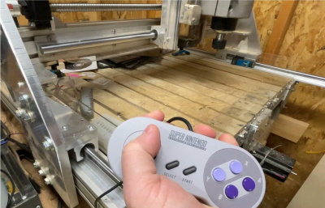

# SNES-Jog: Making a UGS CNC Jog Controller from an SNES controller

Code and Instructions for adapting an "SNES Classic mini" gamepad for use as a
CNC Jog Controller with fabulously free & useful
[Universal GCode Sender](http://winder.github.io/ugs_website/). I learned
everything in the code from trial & error, plus reading through
[this file](https://github.com/mistydemeo/super_nes_classic_edition_oss/blob/master/clvcon-km-6fd0ec177b321206da5bc1b288fd6d7fdf5df7ae/clvcon-km-6fd0ec177b321206da5bc1b288fd6d7fdf5df7ae/clvcon.c).
After doing all that, I discovered that there's a library that also handles this
stuff living written by another fine specimen of Kevinhood with the handle
[MadHephaestus](https://github.com/madhephaestus/WiiChuck). I'll probably go
steal some stuff from that library before I'm done here.

Good luck! Feel free to open issues.

[Click here for the UGS stuff to verify before each use](#Step-8-Before-each-use-of-UGS)

To see a full video of it in (one handed) action,
[click here](https://1drv.ms/v/s!Ap9iqQ7FiN9Qhswu_Yi-vvz0VaJNSQ)

## Jog Controller details

| Operation                       | Controller Combo                    |
| ------------------------------- | ----------------------------------- |
| Enable/Disable pendant          | `Left Bumper` + `Start`             |
| **Motion**                      |
| X/Y Motion                      | `DPad` + Optional Bumpers \*        |
| Raise Z                         | `A` + Optional Bumpers \*           |
| Lower Z                         | `B` + Optional Bumpers \*           |
| **Zeroing**                     |
| Return to zero                  | `Left Bumper` + `Select`            |
| Reset Zero All                  | `Start` + `Select`                  |
| Reset Zero X                    | `Both Bumpers` + `X`                |
| Reset Zero Y                    | `Both Bumpers` + `Y`                |
| Reset Zero Z                    | `Both Bumpers` + `Start`            |
| **Other**                       |
| Go Home                         | `Both Bumpers` + `Select` + `Start` |
| Soft Reset                      | `Right Bumper` + `Select`           |
| Unlock                          | `Right Bumper` + `Start`            |
| **Not Yet Implemented**         |
| Start program & disable pendant | Seems like a common thing to do...  |

**\* Bumper Speed Adjustment:** For X/Y Directions, press the DPad. Hold one
bumper (either one) to go the "medium" distance (10x normal). Hold _both_
bumpers to go the "large" distance (100x normal). For the Z direction, use the
A/B buttons for up/down. Same as the DPad, hold one bumper (either one) for
'medium' and both for 'large' distance.

Note: I'm probably going to change the controller bindings a bit, as I'd like
them to be a bit more "consistent".

## [Step 1: Make the thing](./docs/building.md)

## [Step 2: Flash the firmware on the thing](./docs/flashing.md)

## [Step 3: Configure UGS to use the thing](./docs/configure.md)

## Step #4: PROFIT!

For implementation details, head on [over here](./docs/implementation.md)

## Motivation

I've been running a
[CNC Machine](https://millrightcnc.com/product/millright-cnc-power-route-kit-bundle/)
for several years now. Unfortunately, it's kind of clunky to control using a
mouse or keyboard. There are a variety of devices one can purchase called "Jog
Controllers" that give you a dedicated device for moving around the CNC spindle.
The trouble is, they're expensive, and I have no idea if they'd work with my
little hobbyist setup, using the reasonably good UGS G-Code sender/CNC control
software.

# TODO

## Software

- Switch to using `XY 10` and `Z 1` commands instead of remembering current
  values (which may change)
- Make the big switch into a declarative state machine of some kind
- Maybe break the code into better pieces to enable support for other
  controllers/protocols?

# Documentation

- Pictures
- General improvement

# Hardware

- Make a little 3D printed case?
