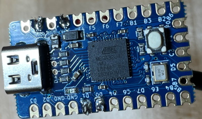
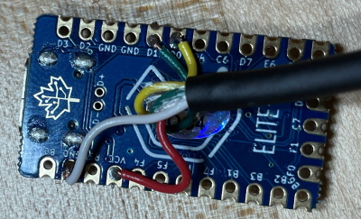
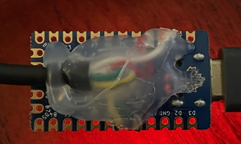

# Hardware: How to make the thing

**How to make a Jog Controller for use with UGS from an SNES classic
controller**

The SNES Classic controller is a simple I2C peripheral. For folks who don't know
what that is, just trust that this makes it _super_ easy to talk to from just
about any Arduino device.

## Requirements

- Hardware

  - SNES Classic Mini controller (Wired)
    [Amazon link for the controller](https://www.amazon.com/Mario-Retro-SNES-MINI-Controller-Compatible/dp/B0779DS931/ref=sr_1_54_sspa?dchild=1&keywords=SNES&qid=1631203806&s=videogames&sr=1-54-spons&psc=1&spLa=ZW5jcnlwdGVkUXVhbGlmaWVyPUExN1ZZMDk0UjdEVEc4JmVuY3J5cHRlZElkPUEzU0pFS1VYOVBXMkxBJmVuY3J5cHRlZEFkSWQ9QTA2MTE1NzYxNTBXNTRDMERJQ1lTJndpZGdldE5hbWU9c3BfbXRmJmFjdGlvbj1jbGlja1JlZGlyZWN0JmRvTm90TG9nQ2xpY2s9dHJ1ZQ==),
    [Amazon link for the whole package](https://www.amazon.com/Console-Classic-Built-Controllers-Birthday/dp/B08V4RJQPF/ref=sr_1_2_sspa?dchild=1&keywords=SNES+classic&qid=1631204003&s=videogames&sr=1-2-spons&psc=1&spLa=ZW5jcnlwdGVkUXVhbGlmaWVyPUEzSUZEMTBaTDBSUFBOJmVuY3J5cHRlZElkPUEwMTczMzg0MllGV1hEMDNGR0Y5TSZlbmNyeXB0ZWRBZElkPUEwMjYwMDk0MjNWWUc2N0ZWOFFENSZ3aWRnZXROYW1lPXNwX2F0ZiZhY3Rpb249Y2xpY2tSZWRpcmVjdCZkb05vdExvZ0NsaWNrPXRydWU=)
  - An Arduino-compatible device that supports both USB keyboard protocol & I2C.
    Some possibilities:

    - [Keebio USB Elite-C ($18)](https://keeb.io/collections/diy-parts/products/elite-c-low-profile-version-usb-c-pro-micro-replacement-atmega32u4)
      - **This is what I'm using: Fully tested and working with my CNC**
    - [Teensy LC ($12)](https://www.pjrc.com/store/teensylc.html) /
      [Teensy 3.2 ($20)](https://www.pjrc.com/store/teensy32.html) /
      [Teensy 4 ($20)](https://www.pjrc.com/store/teensy40.html) ($10-$20)
      - **I tested the software first using a Teensy 3.2**
    - [SparkFun Pro Micro ($8)](https://keeb.io/collections/diy-parts/products/pro-micro-5v-16mhz-arduino-compatible-atmega32u4)
      - This is pretty cheap, but I hear the USB connector is prone to rip off,
        so be careful (That's a key point of upgrade for the Elite-C I used)
    - [SEEED Stuidio's 2 XIAO](https://www.seeedstudio.com/Seeeduino-XIAO-Arduino-Microcontroller-SAMD21-Cortex-M0+-p-4426.html)
      [class of devices](https://www.seeedstudio.com/XIAO-RP2040-v1-0-p-5026.html)
      looks like the smallest & cheapest ($6!) doodad that fits the bill.
      - I've got a couple around, but haven't tried them yet.
    - [Adafruit nRF52840 device ($20-$35)](https://www.adafruit.com/product/4481)
      or the [Adafruit Trinket M0 ($9)](https://www.adafruit.com/product/3500)
      - I've used these for a variety of keyboards, and can confirm that they
        fit the bill, though the Trinket you'll have to solder wires to _pads_
        which can be a PITA...
    - Basically, you can use any Arduino device that supports the Keyboard and
      Wire libraries (They need to have a USB port on them, though that may not
      mean they support behaving as a keyboard)
      - A _lot_ of devices fall under this guise. I have a variety of these
        laying around. I only have a single Arduino-brand device, though,
        because they're _really_ overpriced/underpowered compared to the
        alternatives

  - Optional:
    - A Nintendo Controller adapter.
      [Adafruit makes a simple one for $3](https://www.adafruit.com/product/4836)
      - I didn't bother with my initial build
      - This would enable you to NOT cut the wires for the controller, making
        the end result a bit 'cleaner'

- Tools

  - Soldering Iron & Solder
  - Without the adapter, wire cutters
  - Optional
    - Hot glue gun & hot glue

- Skills

  - Soldering
  - Wire stripping
  - Digging around on your Arduino-compatible device's pinout diagram to figure
    out which pins are: Power, Ground, SCL, and SDA.

## Steps

### Without the Nintendo Controller Adapter plug

### Step 1 Cut the wires

If you didn't get a Nintendo Controller adapter plug, you'll need to cut the
plug off of your SNES Classic controller & strip the 4 wires so you can solder
them to your controller. The 4 wires in my controller are Red, White, Yellow,
and Green.

### Step 2 Figure out pins

Identify which pins on your Arduino-ish device are

- Power
  - Often referred to as "VCC" in pinout diagrams. Some devices have 3V and 5V
    power available. Both seem to work with the SNES I have: Your Mileage May
    Vary)
- Ground
  - Typically "GND". Frequently there are multiple of them available.
- SCL
  - This is the I2C bus' "Clock" pin. It's probably labeled exactly SCL. It
    might also be labeled SCL0 or I2C_SCL or something.
- SDA
  - This is the I2C bus' "Data" pin. If your device has multiple I2C buses
    available, make sure you're using the same as the SCL pin (SCL0, then SDA0:
    If you're using SCL1, you probably need to make minor edits to the code and
    make sure you're using SDA1)

### Step 3 Strip the wires

Once you've identified which pins are which, strip & solder the wires from your
SNES controller to the Arduino-ish device like this:

- White to GND
- Red to Power
- Yellow to SCL
- Green to SDA

### Step 4 Soldering

**Ready for soldering**

**Soldering complete**

I know: I'm _amazing_ as soldering.

### Step 5 Hot glue

To make the thing hold together a little better, I hot glued the underside of
the Arduino-ish device (in the photos, it's a "USB Elite-C" Pro-Micro clone I
had laying around.)

**Hardware is done!**

After you've got those 4 wires soldered, all you've got left is to get the
firmware flashed onto the Arduino device.

[Move on to the Software portion](./flashing.md)