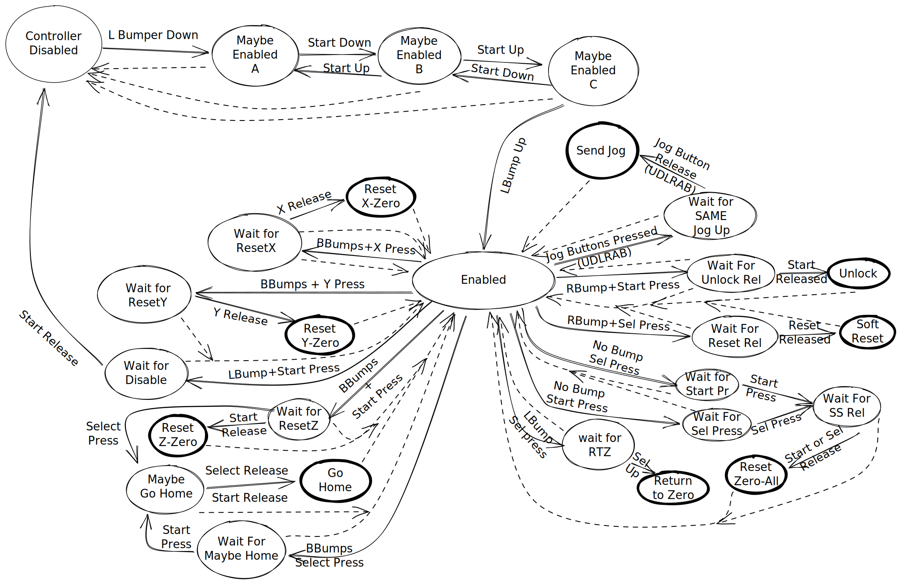

# Debugging

I used [Carnac](https://github.com/Code52/carnac) on Windows to make sure the
device was sending the right keystrokes to the device. It was pretty helpful
without needing to try stuff with the CNC. This actually enabled it to work
first try with the machine!

## Implementation Details

It's Arduino-native, so it's all in a single `.ino` file. A bunch of stuff is
moved into headers, just so it's not a single gigantic file.

Here's a state transition diagram for your viewing enjoyment. It's explicitly
designed to not accidentally trigger multiple jogs (that's why I didn't use
something like QMK with some custom keymap & layers to run the thing: I'm
paranoid)

